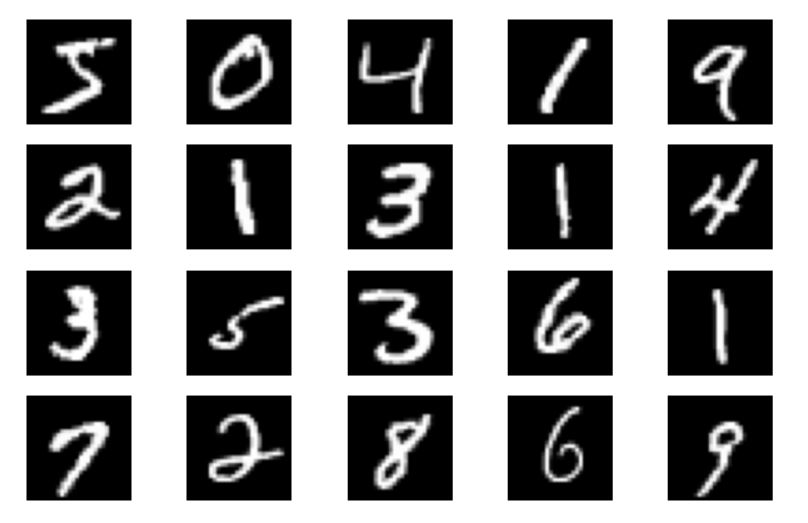
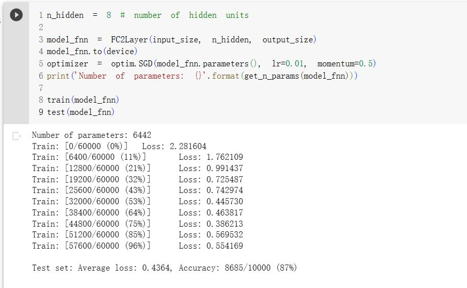
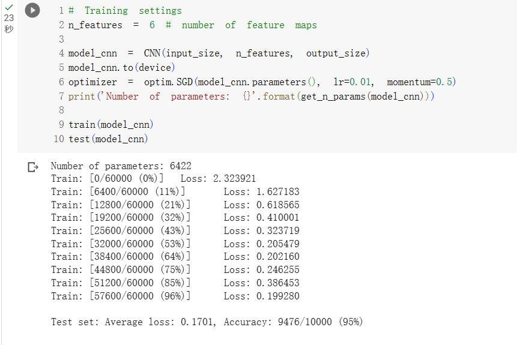
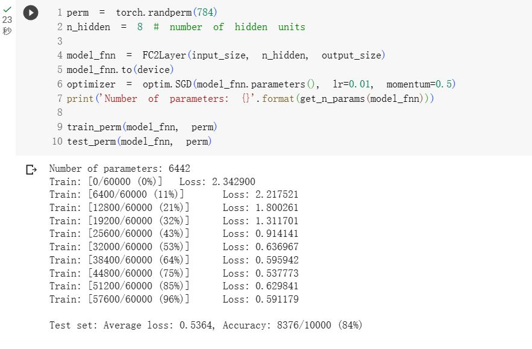
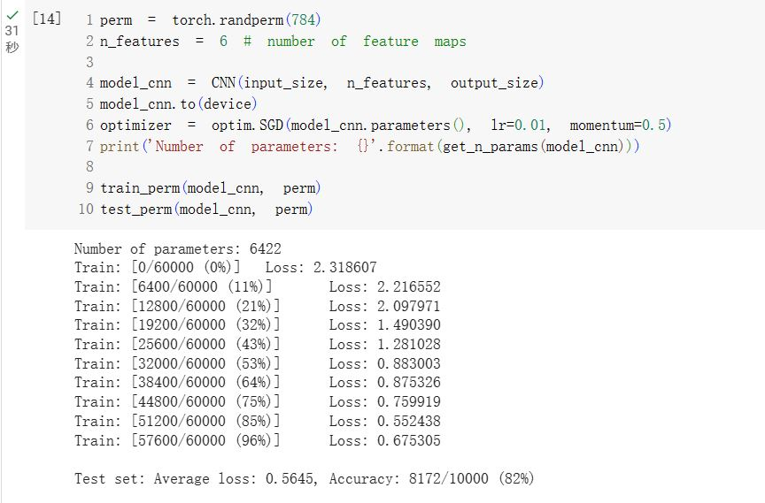
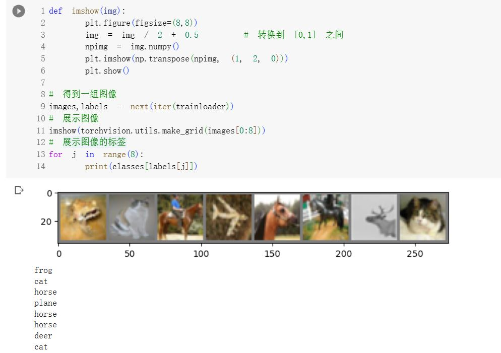
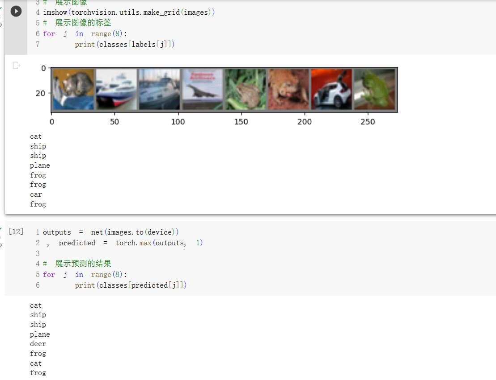
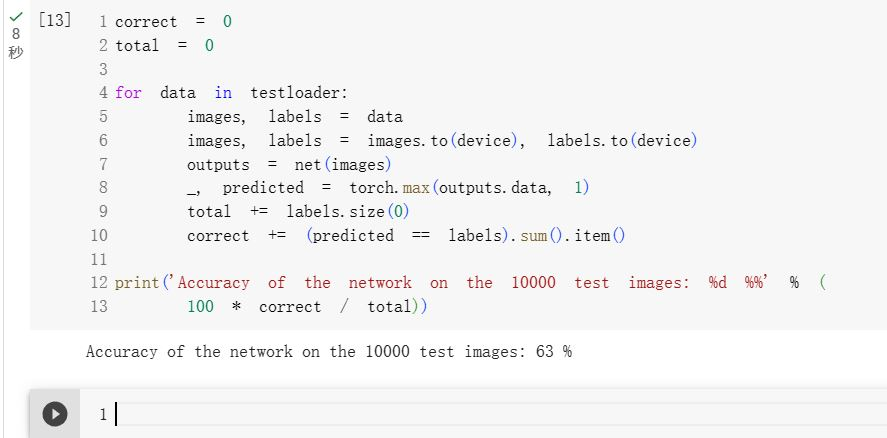
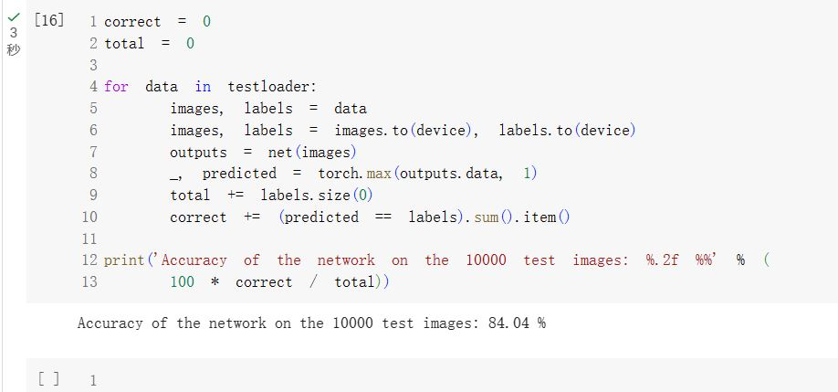

# 暑期DL学习week2-xliang

## 1. 代码练习

### MNIST数据集分类

##### MNIST数据集图片可视化展示

```python
plt.figure(figsize=(8, 5))
for i in range(20):
    plt.subplot(4, 5, i + 1)
    image, _ = train_loader.dataset.__getitem__(i)
    plt.imshow(image.squeeze().numpy(),'gray')
    plt.axis('off');
```



##### 小型全连接网络

view函数一般用于改变输入或者输出的shape，需要两个参数，分别为行和列，其中必须指定一个参数，另一个参数用-1代替可以自动计算得出。

```python
class FC2Layer(nn.Module):
    def __init__(self, input_size, n_hidden, output_size):
        super(FC2Layer, self).__init__()
        self.input_size = input_size
        self.network = nn.Sequential(
            nn.Linear(input_size, n_hidden),
            nn.ReLU(),
            nn.Linear(n_hidden, n_hidden),
            nn.ReLU(),
            nn.Linear(n_hidden, output_size),
            nn.LogSoftmax(dim=1)
        )
    def forward(self, x):
        x = x.view(-1, self.input_size)
        return self.network(x)
```

小型全连接网络训练结果如下：



##### 卷积神经网络

其中Conv2d代表二维卷积层，Linear代表全连接操作。

Conv2d的通道数应与图片通道数或上一层卷积层的输出通道数一致；Linear的输入神经元数应与上一层的输出一致，输出参数为期望的输出神经元个数

```python
class CNN(nn.Module):
    def __init__(self, input_size, n_feature, output_size):
        super(CNN, self).__init__()
        self.n_feature = n_feature
        self.conv1 = nn.Conv2d(in_channels=1, out_channels=n_feature, kernel_size=5)
        self.conv2 = nn.Conv2d(n_feature, n_feature, kernel_size=5)
        self.fc1 = nn.Linear(n_feature*4*4, 50)
        self.fc2 = nn.Linear(50, 10)

    def forward(self, x, verbose=False):
        x = self.conv1(x)
        x = F.relu(x)
        x = F.max_pool2d(x, kernel_size=2)
        x = self.conv2(x)
        x = F.relu(x)
        x = F.max_pool2d(x, kernel_size=2)
        x = x.view(-1, self.n_feature*4*4)
        x = self.fc1(x)
        x = F.relu(x)
        x = self.fc2(x)
        x = F.log_softmax(x, dim=1)
        return x
```

卷积神经网络对MNIST数据集分类效果如下：



##### 打乱数据集图片像素

```python
perm = torch.randperm(784)
plt.figure(figsize=(8, 4))
for i in range(10):
    image, _ = train_loader.dataset.__getitem__(i)
    
    image_perm = image.view(-1, 28*28).clone()
    image_perm = image_perm[:, perm]
    image_perm = image_perm.view(-1, 1, 28, 28)
    plt.subplot(4, 5, i + 1)
    plt.imshow(image.squeeze().numpy(), 'gray')
    plt.axis('off')
    plt.subplot(4, 5, i + 11)
    plt.imshow(image_perm.squeeze().numpy(), 'gray')
    plt.axis('off')
```


对打乱像素的图片再次训练，可见全连接神经网络没有变化，而卷积神经网络的准确率明显降低。



​															全连接神经网络



​															卷积神经网络

卷积层使得网络对图片像素的局部关系进行学习，而错乱的像素排列会使卷积操作没有优势，导致卷积神经网络的学习能力下降。

### 使用CNN对CIFAR10 数据集分类

```Python
def imshow(img):
    plt.figure(figsize=(8,8))
    img = img / 2 + 0.5     # 转换到 [0,1] 之间
    npimg = img.numpy()
    plt.imshow(np.transpose(npimg, (1, 2, 0)))
    plt.show()
    
# 得到一组图像
images, labels = next(iter(trainloader))
# 展示图像
imshow(torchvision.utils.make_grid(images))
# 展示图像的标签
for j in range(8):
    print(classes[labels[j]])
```



经过10epochs的训练后对一组图片进行预测



CNN在CIFAR10数据集上的综合表现：



可见CNN在该数据集上的分类效果并不优秀。不过网络结构的改进空间还很大，通过改进网络规模，优化激活函数和调整优化器策略可以提高网络的性能。

### 使用VGG16对CIFAR10 数据集分类

此处对训练集的的transform操作加入了对图片的随机裁剪和概率水平翻转，以及归一化的各通道参数与之前的MNIST数据集也不相同。

```python
transform_train = transforms.Compose([
    transforms.RandomCrop(32, padding=4),
    transforms.RandomHorizontalFlip(),
    transforms.ToTensor(),
    transforms.Normalize((0.4914, 0.4822, 0.4465), (0.2023, 0.1994, 0.2010))])

transform_test = transforms.Compose([
    transforms.ToTensor(),
    transforms.Normalize((0.4914, 0.4822, 0.4465), (0.2023, 0.1994, 0.2010))])
```

简化版VGG网络模型的实现

```
class VGG(nn.Module):
    def __init__(self):
        super(VGG, self).__init__()
        self.cfg = [64, 'M', 128, 'M', 256, 256, 'M', 512, 512, 'M', 512, 512, 'M']
        self.features = self._make_layers(cfg)
        self.classifier = nn.Linear(512, 10) 
        #Linear的输入神经元个数应与上一层的输出一致

    def forward(self, x):
        out = self.features(x)
        out = out.view(out.size(0), -1)
        out = self.classifier(out)
        return out

    def _make_layers(self, cfg):
        layers = []
        in_channels = 3
        for x in cfg:
            if x == 'M':
                layers += [nn.MaxPool2d(kernel_size=2, stride=2)]
            else:
                layers += [nn.Conv2d(in_channels, x, kernel_size=3, padding=1),
                           nn.BatchNorm2d(x),
                           nn.ReLU(inplace=True)]
                in_channels = x
        layers += [nn.AvgPool2d(kernel_size=1, stride=1)]
        return nn.Sequential(*layers)
```

简化的VGG16在CIFAR10数据集上的表现：



可见加入了更多卷积和池化操作的VGG网络在该数据集上的表现比CNN更好。

## 2. 问题总结

1. **dataloader 里面 shuffle 取不同值有什么区别？**

   TRUE代表将数据集的图片顺序进行打乱，FALSE代表不对数据集进行乱序

2. **transform 里，取了不同值，这个有什么区别？**

   transform.normalize函数对rgb三个通道进行标准化计算，第一个参数为均值mean，第二个参数为标准差std，使得均值变为0，标准差变为1，计算公式如下：
   $$
   OutputChannel=\frac{(IntputChannel-MeanChannel)}{StdChannel}
   $$
   

3. **epoch 和 batch 的区别？**

   通常而言若干个batch组成一个epoch，一个epoch代表训练集完整的进行了一次训练，而训练集一次性进入网络不现实，所以需要将一个epoch划分成若干个batch。

4. **1x1的卷积和 FC 有什么区别？主要起什么作用？**

   数学本质一样，但是全连接层的输入尺寸是固定的，卷积层的输入尺寸是任意的。

   1*1卷积可以减少或增加特征图的层数，卷积后通常会加入激活函数增加非线性因素；而全连接仅起到分类器的作用。

5. **residual learning为什么能够提升准确率？**

   residual learning解决了网络深度越深带来的梯度消失和梯度爆炸，主要思想是去掉相同的主体，突出微小的变化，引入残差后的映射对输出的变化更敏感，输出的变化对权重的调整影响更大，也就是说反向传播的梯度值更大，训练就更加容易。

6. **代码练习二里，网络和1989年 Lecun 提出的 LeNet 有什么区别？**

   代码练习2中使用的池化为MaxPool2d,激活函数是Relu； LeNet中使用的池化为AdaptiveAvgPool2d，激活函数是Sigmoid。

7. **代码练习二里，卷积以后feature map 尺寸会变小，如何应用 Residual Learning?**

   采用1*1的卷积对大小不同的feature map进行调整。

8. **有什么方法可以进一步提升准确率？**

   - 设置合适的学习率或者选择合适的优化器

   - 选择合适的激活函数

   - 选择合适的损失函数

   - 正则化以防止过拟合

   - 优化网络规模，选择合适的深度和宽度

   - 对数据集合适的预处理也可以防止过拟合

   - 适当延长训练时间防止欠拟合

     

